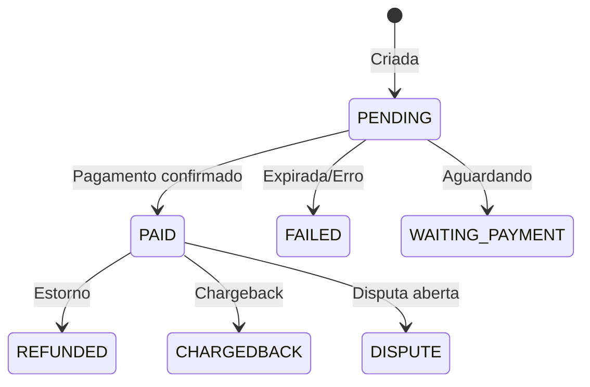

## Base URL

```
https://api.thalbank.com
```

## Autenticacao

Todas as requisicoes autenticadas aceitam dois metodos:

| Metodo | Header | Formato |
|--------|--------|---------|
| **API Key** | `x-api-key` | Chave gerada no dashboard |
| **JWT Bearer** | `Authorization` | `Bearer <access_token>` |

<Tip>
  Para integracoes server-to-server, recomendamos **API Key**. Use JWT para fluxos com login de usuario.
</Tip>

## Formato

- **Content-Type:** `application/json`
- **Valores monetarios:** sempre em **centavos** (integer). R$ 15,00 = `1500`
- **Datas:** ISO 8601 com timezone (`2026-03-10T00:00:00.000Z`)
- **IDs:** UUID v4 (`a1b2c3d4-e5f6-7890-abcd-ef1234567890`)

## Paginacao

Endpoints de listagem suportam paginacao via query params:

| Param | Tipo | Default | Descricao |
|-------|------|---------|-----------|
| `take` | number | 10 | Registros por pagina |
| `skip` | number | 0 | Offset (pular N registros) |
| `cursor` | string | - | Cursor para paginacao eficiente |

**Resposta paginada:**
```json
{
  "status": true,
  "data": [...],
  "count": 150,
  "nextCursor": "abc123"
}
```

## Idempotencia

Endpoints de criacao (`POST /transactions`, `POST /withdrawals`) exigem o header `Idempotency-Key` com um UUID v4 unico. Requisicoes com a mesma chave retornam o mesmo resultado sem processar novamente.

```
Idempotency-Key: 550e8400-e29b-41d4-a716-446655440000
```

## Rate Limiting

| Tipo | Limite |
|------|--------|
| Requisicoes por minuto | 120 |
| Criacao de transacoes | 60/min |

Respostas com `429 Too Many Requests` incluem o header `Retry-After`.

## Status das transacoes



| Status | Descricao |
|--------|-----------|
| `PENDING` | Transacao criada, aguardando pagamento |
| `WAITING_PAYMENT` | Em processamento pelo provedor |
| `PROCESSING` | Pagamento em andamento |
| `AUTHORIZED` | Cartao autorizado (pre-captura) |
| `PAID` | Pagamento confirmado |
| `FAILED` | Falha ou expirada |
| `REFUSED` | Recusada pelo provedor |
| `REFUNDED` | Estorno realizado |
| `CHARGEDBACK` | Chargeback pelo portador |
| `DISPUTE` | Em disputa |

## Status dos saques

| Status | Descricao |
|--------|-----------|
| `PENDING` | Saque solicitado |
| `APPROVED` | Aprovado para processamento |
| `REJECTED` | Rejeitado |
| `PROCESSING` | Em processamento pelo provedor |
| `PAID` | Saque realizado |
| `FAILED` | Falha no processamento |
