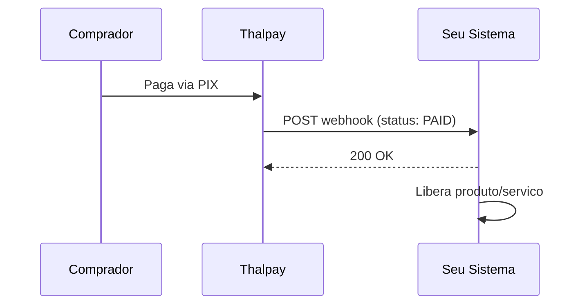

## Como funcionam

Webhooks sao notificacoes HTTP (POST) enviadas pelo Thalpay para o seu sistema quando o status de uma transacao ou saque muda. Em vez de fazer polling, voce recebe a informacao em tempo real.



## Registrar um webhook

```bash
curl -X POST https://api.thalbank.com/webhooks \
  -H "x-api-key: sua_api_key" \
  -H "Content-Type: application/json" \
  -d '{
    "url": "https://seusite.com/webhooks/thalpay",
    "eventType": "ALL"
  }'
```

### Tipos de evento

| Tipo | Descricao |
|------|-----------|
| `TRANSACTION` | Mudancas de status em transacoes |
| `WITHDRAWAL` | Mudancas de status em saques |
| `DISPUTE` | Disputas abertas ou resolvidas |
| `ALL` | Todos os eventos acima |

## Payload do webhook

### Transacao

```json
{
  "event": "TRANSACTION_UPDATED",
  "data": {
    "id": "a1b2c3d4-e5f6-7890-abcd-ef1234567890",
    "externalRef": "seu-ref-123",
    "status": "PAID",
    "amount": 1500,
    "netAmount": 1350,
    "feeAmount": 150,
    "method": "PIX",
    "paidAt": "2026-03-10T00:05:00.000Z",
    "metadata": { "orderId": "ORD-001" }
  }
}
```

### Saque

```json
{
  "event": "WITHDRAWAL_UPDATED",
  "data": {
    "id": "b2c3d4e5-f6a7-8901-bcde-f12345678901",
    "status": "PAID",
    "amount": 10000,
    "method": "PIX",
    "paidAt": "2026-03-10T12:00:00.000Z"
  }
}
```

## Resposta esperada

Seu endpoint deve retornar **status 200** (ou 2xx) em ate **15 segundos**. Caso contrario, o Thalpay fara retentativas.

### Politica de retry

| Tentativa | Delay |
|-----------|-------|
| 1a | Imediata |
| 2a | 30 segundos |
| 3a | 2 minutos |
| 4a | 10 minutos |
| 5a | 1 hora |

Apos 5 tentativas sem sucesso, o webhook e marcado como falho. Voce pode reenviar manualmente via API.

## Boas praticas

<AccordionGroup>
  <Accordion title="Responda rapido, processe depois">
    Retorne 200 imediatamente e processe o webhook em background (fila). Isso evita timeouts.
  </Accordion>
  <Accordion title="Seja idempotente">
    Seu endpoint pode receber o mesmo webhook mais de uma vez. Use o `id` da transacao para verificar se ja foi processado.
  </Accordion>
  <Accordion title="Use HTTPS">
    A URL do webhook deve usar HTTPS. URLs HTTP serao rejeitadas.
  </Accordion>
  <Accordion title="Valide a origem">
    Verifique que a requisicao vem do Thalpay checando os IPs de origem ou a assinatura do payload.
  </Accordion>
</AccordionGroup>

## Reenviar webhooks

Se um webhook falhou ou voce precisa reprocessar:

```bash
# Reenviar webhook de transacao
curl -X POST https://api.thalbank.com/webhooks/resend-transaction-event \
  -H "x-api-key: sua_api_key" \
  -H "Content-Type: application/json" \
  -d '{
    "transactionIds": ["a1b2c3d4-e5f6-7890-abcd-ef1234567890"]
  }'
```

```bash
# Reenviar webhook de saque
curl -X POST https://api.thalbank.com/webhooks/resend-withdrawal-event \
  -H "x-api-key: sua_api_key" \
  -H "Content-Type: application/json" \
  -d '{
    "withdrawalIds": ["b2c3d4e5-f6a7-8901-bcde-f12345678901"]
  }'
```
