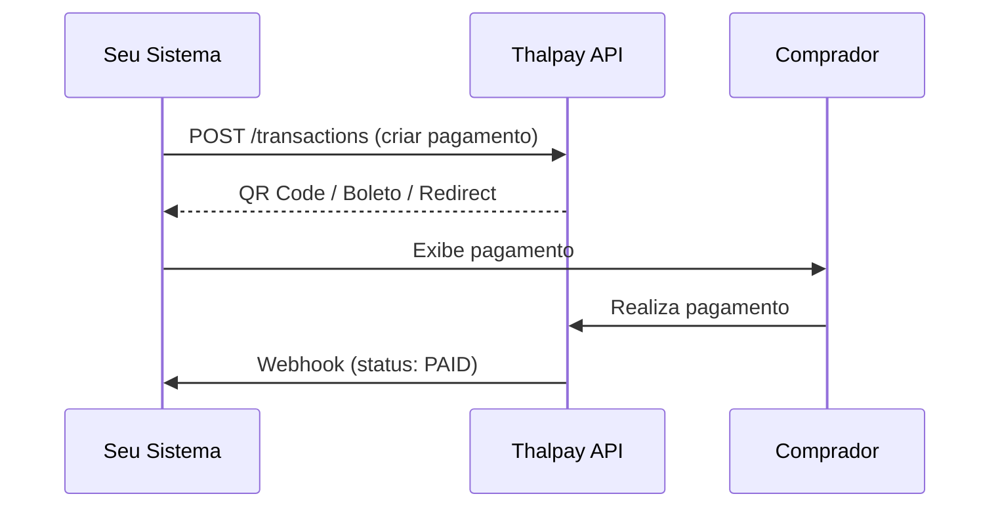

## Bem-vindo ao Thalpay

O Thalpay e um gateway de pagamentos que permite processar transacoes via PIX, Boleto Bancario e Cartao de Credito atraves de uma unica API.

<CardGroup cols={2}>
  <Card title="Quickstart" icon="rocket" href="/quickstart">
    Integre em minutos com nosso guia passo a passo.
  </Card>
  <Card title="API Reference" icon="code" href="/api-reference/introduction">
    Documentacao completa de todos os endpoints.
  </Card>
  <Card title="Webhooks" icon="bell" href="/guides/webhooks">
    Receba notificacoes em tempo real sobre suas transacoes.
  </Card>
  <Card title="Autenticacao" icon="lock" href="/guides/authentication">
    Entenda como autenticar suas requisicoes.
  </Card>
</CardGroup>

## Metodos de pagamento suportados

| Metodo | Tipo | Descricao |
|--------|------|-----------|
| **PIX** | Tempo real | Pagamento instantaneo via QR Code ou copia-e-cola |
| **Boleto** | 1-3 dias uteis | Boleto bancario com vencimento configuravel |
| **Cartao de Credito** | Tempo real | Ate 12x com parcelamento |

## Fluxo basico de integracao

## Ambientes

| Ambiente | Base URL |
|----------|----------|
| **Producao** | `https://api.thalpay.com` |
| **Sandbox** | `https://sandbox.thalpay.com` |

<Note>
  Todas as requisicoes devem usar HTTPS. Valores monetarios sao sempre em **centavos** (R$ 10,00 = `1000`).
</Note>
